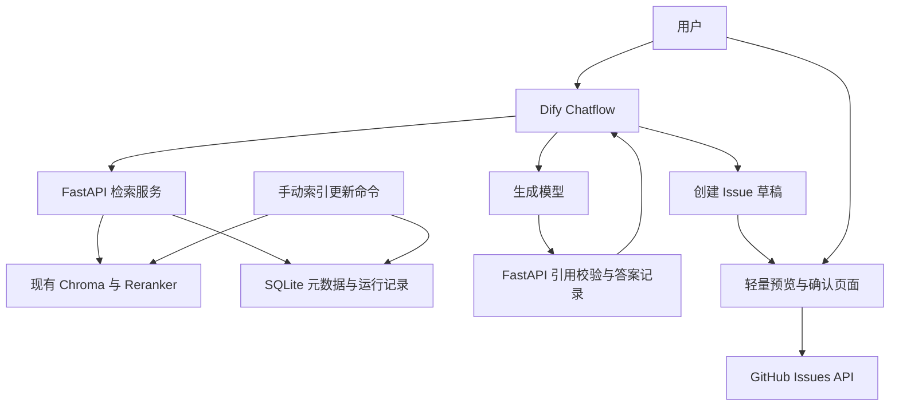

# 研发知识助手｜代码库 RAG 与问题处理工作流

开发 Handoff · 2026-10-05 · 目标：用于 FDE 实习求职的可运行、可演示、可交接项目。

## 0. 如何使用这份文档

把本文交给开发助手，先执行 M0，再按里程碑推进。本文是开发规格，不代表这些功能已经完成。此次仅编写 handoff，不修改简历、不启动项目开发、不向 GitHub 提交内容。

**核心目标：复用已有代码库 RAG，增加 Dify 交互、可靠引用、GitHub Issue 草稿与确认提交、索引更新、部署和验收。**

第一版只做一个指定仓库、一个指定版本、单操作者的受控演示环境。实现应当尽量复用旧项目，不先重建完整平台。

完成的含义：真实依赖下跑通主要流程，关键异常可复现，另一人能按文档部署使用。Mock 测试通过不能替代 Dify、模型和 GitHub 的实际集成验证。

## 1. 已有基础与需要确认的事实

用户报告已完成以下工作，开发前需找到对应代码、配置、数据和结果：

- Python、Chroma 实现代码库清洗、切片、向量化、召回和重排序。
- 自建 60 条分类标注的 ground-truth 检索评测集，做过单变量实验。
- 清理被误索引的第三方代码，按语义边界重新切块。
- BM25 与向量混合检索在该语料上收益为负，最终没有采用。
- 接入过 Ragas，发现所用指标在当前代码语料、标注方式下存在适配问题，采用检索层与生成层分开评测。

这些是用户提供的项目背景，尚未在当前工作区核验。不要编造命中率、试用人数、提效比例或实验报告；不要将“混合检索无收益”外推到所有语料。

> 2026-10-05 更新：原 RAG 项目已定位，见 `HANDOFF.md` 第 2 节；M0 基线见 `docs/baseline.md`。下表保留为原始规格。

启动时需要确认：

| 输入 | 当前状态 | 处理方式 |
| --- | --- | --- |
| 原 RAG 工程路径 | 待提供 | 找到工程后读取其 README、依赖与 AGENTS.md；路径不明时向用户询问 |
| 原始 60 条评测集与历史结果 | 待定位 | 保留原文件并检查标注结构；缺失则报告，不重新制造历史数据 |
| 用于索引的仓库与 commit | 待选择 | 默认建议用户自有、熟悉且可演示的公开仓库 |
| Embedding、Reranker 与生成模型 | 待核验 | 优先沿用旧项目；记录具体版本、参数和调用方式 |
| Dify 环境 | 待核验 | 优先复用已有环境，否则按官方方式启动固定版本的本地自托管环境 |
| GitHub 测试 Issue 仓库 | 待指定 | 使用用户控制的测试仓库，可与索引仓库不同 |
| API 凭证 | 待本地配置 | 仅通过环境变量或 Secret 配置；不要求用户在聊天中粘贴密钥 |

缺少凭证时可以推进本地逻辑与 Mock 测试，并将真实集成标为待验证。不要声称整个项目已经完成。

## 2. 用户场景与范围

### 2.1 目标用户与任务

目标用户：刚接触指定仓库的开发者。

三个首要任务：

1. 找实现：某个接口、配置或功能在哪里实现？提供代码位置和有依据的解释。
2. 查操作：根据当前版本文档，如何安装、启动或运行测试？返回有来源的步骤。
3. 转问题单：答案未解决问题时，整理问题描述、相关代码、环境及已尝试步骤，经用户确认后提交 Issue。

开发开始时与用户确认至少 3 个真实问题，将原有处理方式、需要的结果和不可接受的错误写进 `docs/requirements.md`。后续若能找到真实试用者，再据反馈调整。

### 2.2 第一版必须包含

- 一个仓库的代码和 Markdown 开发文档，绑定指定 commit。
- 现有检索逻辑的服务化，不默认恢复已经验证无收益的混合检索。
- Dify 问答流程及可使用的入口。
- 可追溯引用、信息不足时澄清、证据不足时明确限制、依赖故障时显示错误。
- Issue 草稿、人工确认、提交状态查询与重复提交控制。
- 手动触发的版本更新，正确处理新增、修改、删除文件。
- 检索、回答、任务三层评测，运行日志和用户反馈记录。
- 部署配置、工作流导出、使用与排障文档、完整 Demo。

### 2.3 第一版不做

- 多租户、组织级 SSO、完整 RBAC、任意私有仓库的权限同步。
- 自动修改代码、自动提交 PR、执行仓库中的命令。
- GraphRAG、复杂多 Agent、自建前端平台、训练或微调模型。
- 同时集成 GitHub、飞书、Jira；第一版只用 GitHub Issues。
- MCP 和 Dify 外部知识库两套适配。第一版只用 Dify HTTP Request 接自建 API。
- 自动 Webhook 更新、后台任务集群或 Kubernetes。手动更新和单实例即可。

## 3. 架构与职责



### 3.1 组件选择

| 组件 | 职责 | 约束 |
| --- | --- | --- |
| 原 RAG 模块 | 清洗、切块、Embedding、召回、重排序 | 保留现有有效配置，先复现再调整 |
| FastAPI | 检索适配、来源校验、记录、Issue 状态 | 不写第二套重复检索逻辑 |
| Dify Chatflow | 用户输入、缺失信息澄清、检索调用、生成和回答展示 | 用 HTTP 节点接入，不重建 Dify 内置知识库 |
| SQLite | 索引版本指针、运行记录、反馈、Issue 草稿和提交状态 | 单实例持久化，数据库事务与唯一约束控制并发 |
| Chroma | 片段与向量检索 | 固定兼容版本，持久化；沿用旧项目部署方式 |
| FastAPI 模板页面 | 登录、Issue 预览、编辑、确认、提交状态 | 简单 HTML 即可，无需 React |
| GitHub API | 在指定测试仓库创建 Issue、对账 | 凭证只存在服务端；目标仓库由配置限定 |

生成由 Dify 负责，检索由 Python 负责。FastAPI 的引用校验保证“来源存在且属于本次检索”，不宣称它能自动证明答案语义正确；语义支持情况在评测中另行检查。

## 4. 数据接入、引用与版本更新

### 4.1 接入规则

- 只索引配置中允许的仓库与路径。第一版不接受用户输入任意 URL 或本机路径。
- 明确索引的是 Git commit 对应内容，不把未提交工作区文件混入版本引用。
- 沿用原项目切块方法；先支持现有语言和 Markdown，不一开始泛化到所有语言。
- 排除 `.git`、依赖目录、vendor、构建产物、二进制、密钥文件和超大文件；不通过符号链接越过允许范围。
- 文档/代码是待分析数据，其中出现的指令不改变系统规则或触发外部写操作。

### 4.2 每个片段的必要元数据

```text
chunk_id           稳定且可区分版本的片段标识
repo_id            服务端配置中的仓库标识
commit_sha         实际读取的完整 commit
index_version      本次完整索引的版本
path               仓库相对路径
start_line/end_line 对应原始文件的真实行号
content_hash       内容指纹
source_type        code 或 docs
symbol             可选，函数或类名
```

检索结果返回片段内容、排名和分数类型。Reranker 分数不是回答正确率；不要把它显示成“答案置信度”。

来源 URL 由后端根据元数据构造，指向 `blob/<commit>/<path>#Lx-Ly`。对路径正确编码，不使用会漂移的默认分支链接，不让生成模型编造路径或行号。

### 4.3 更新方式

先完成“指定 commit 的完整新索引 -> 校验 -> 切换活动版本”。这是第一版必做的可靠更新方式。

- 新版本构建期间，查询继续使用旧的完整版本。
- 一个查询从开始到结束绑定同一个 `index_version`。
- 新版本构建成功后通过事务更新活动版本指针；失败不切换。
- 删除文件不出现在新版本检索结果中；旧回答仍保留其原始 commit 引用。
- 暂时保留上一个完整版本，支持回滚。
- 并发更新串行化或明确返回冲突，避免两个更新互相覆盖。

完整更新验证通过后，可选实现按文件指纹复用未变内容的 Embedding。只有实际实现并测试后才称“增量更新”；否则文档和简历写“版本化索引更新”。

## 5. API 契约草案

以下是本项目拟实现接口，不是现成 Dify API。开发时用 Pydantic 定义 schema，生成 OpenAPI，并补充请求/响应示例。

| 接口 | 用途 | 关键字段与行为 |
| --- | --- | --- |
| `GET /health` | 进程存活 | 不向未授权请求泄露内部配置 |
| `GET /ready` | 可提供检索 | 检查配置、数据库和活动索引；不在每次探活调用付费模型 |
| `POST /api/retrieve` | 检索 | 输入 query、repo_id、受限 top_k；输出 run_id、版本、片段、耗时和状态 |
| `POST /api/answers` | 校验、保存生成结果 | 输入 run_id、answer_text、cited_chunk_ids、status；从本次检索记录解析引用 |
| `POST /api/feedback` | 记录反馈 | run_id、resolved、reason；验证枚举、长度与关联记录 |
| `POST /api/issue-drafts` | 保存问题单草稿 | run_id、用户补充的环境与复现信息；返回 draft_id 和预览页地址 |
| `GET /review/{draft_id}` | 人工查看草稿 | 仅已登录演示操作者可访问 |
| `POST /review/{draft_id}` | 人工编辑草稿 | 保存新 revision，旧确认随即失效 |
| `POST /review/{draft_id}/submit` | 人工确认并提交 | 校验登录会话、CSRF、draft revision；Dify 服务凭证不能调用 |
| `GET /review/{draft_id}/status` | 查询提交结果 | 返回状态；成功时提供 GitHub Issue URL |

检索业务状态使用 `ok`、`no_evidence` 等；无证据与服务故障分开。鉴权失败返回 401/403，参数错误返回 422，依赖不可用返回适当 5xx 和 request ID。

一次问答共用 `run_id`，记录索引、检索配置、模型与 Prompt 版本。未知或失效的 run_id 不允许被随意关联到 Issue。

`POST /api/answers` 的 status 至少区分 `answered`、`insufficient_evidence`；需要澄清时可在检索前结束。不依据唯一相似度阈值决定问题已解决。用户反馈中的 `resolved` 与模型判断分开保存。

## 6. Dify 的实际搭建流程

### 6.1 问答流程

1. 输入问题；仓库固定，页面展示当前索引范围。没有指定符号或版本等关键信息时，提出具体澄清问题，避免循环追问。
2. HTTP 节点调用 `/api/retrieve`，服务凭证使用 Secret 配置。
3. 按 HTTP 状态与业务状态分支：依赖故障展示错误；无证据说明限制；正常检索继续生成。
4. 生成模型使用原始问题与片段回答。要求输出结构化字段：答案、引用的 chunk ID、是否证据不足；引用必须支持相应结论。
5. HTTP 节点调用 `/api/answers`。未知引用、伪造链接或格式错误进入明确错误分支，不直接展示成正常答案。最多一次格式修复，避免无限重试。
6. 展示后端返回的答案与规范化引用，支持记录用户是否解决问题。
7. 用户主动选择“整理问题单”后，再收集环境、报错、已尝试操作等信息，调用草稿接口。缺失信息明确标为未提供，不让模型补造。
8. 返回草稿预览链接，由用户在独立确认页面编辑并提交。

Issue 草稿可用确定性模板生成，第一版不需要额外 Agent。通过明确输入/按钮选择草稿流程，不让模型自行判断就提交 Issue。

### 6.2 环境与交接

- 记录实际 Dify 版本、模型供应商、模型 ID、参数和工作流版本。
- 使用本机环境时，验证 Dify 执行 HTTP 请求的容器能访问后端。容器内 `localhost` 不等于宿主机。
- 若网络代理或 SSRF 防护拦截本地服务，只针对指定服务配置访问，不全局关闭防护。后端地址不得来自用户自由输入。
- 第一版默认同一受控网络/本机演示；Dify Cloud 不能直接访问本机私有地址，不假设它能连通。
- 从实际验证过的 Dify 实例导出 DSL，移除密钥，重新导入一次确认可运行。不要仅手写一个未验证的 YAML 就声称交付。

## 7. Issue 提交：确认与重复控制

### 7.1 内容与授权

草稿至少包含问题、索引版本、已知环境、相关代码引用、已尝试步骤和仍缺的信息。只有用户实际提供的报错才可写作真实报错。

预览页清楚显示目标仓库、标题和正文。浏览器登录会话与 CSRF 防护用于确认提交；共享演示操作者即可，不做复杂账号系统。GitHub Token、Dify Token、管理员密码不放 URL、不进入生成上下文、不写日志。

只向用户指定的测试仓库发送实际测试 Issue。集成测试默认 Mock，真实提交必须由操作者在预览页确认。公开展示前检查草稿中是否含不适合公开的代码或配置。

### 7.2 状态与提交协议

```text
draft -> submitting -> created
                    -> failed
                    -> unknown
```

- 草稿版本号与正文 hash 绑定；用户确认的是当前具体版本，编辑后需要重新确认。
- 创建草稿接口接受稳定的请求幂等键，并在数据库建立唯一约束；同键同内容返回原草稿，同键不同内容返回冲突，防止 Dify 重试生成多个可提交草稿。用户明确创建另一份问题单时使用新键。
- 事务内把允许提交的版本从 draft 标为 submitting；唯一约束与条件更新阻止并发双击。
- 只有持有状态转换结果的执行者才能调用 GitHub。
- GitHub 返回成功并保存 URL 后，标为 created。再次确认同一草稿返回已有状态和 URL。
- 明确拒绝且确认未创建的错误标为 failed，并给出可操作说明。
- failed 状态修正原因后，由操作者明确重新确认，再经事务进入 submitting；created 和 unknown 不走这个重试入口。
- 请求可能已经到达 GitHub、但响应丢失，或成功后本地保存失败时，标为 unknown。进程重启后未完成的 submitting 也转入对账，不能自动再次创建。
- 可在 Issue 正文写入稳定的隐藏 draft 标记，通过指定仓库的 Issue 列表对账。查到对应标记后回填结果；没有查到不等于一定未创建，保持 unknown 并交人工检查。
- 只有查明此前未创建后，才允许操作者重新发起。非只读请求不得套用通用自动重试逻辑。

对外表述为“重复提交控制与不确定结果对账”，不要承诺跨本地数据库和 GitHub 的 exactly-once。

## 8. 评测设计

### 8.1 数据集

- 原 60 条题作为已有开发/回归集。检查分类、标注粒度、来源 commit 和历史使用方式。
- 如果此前已反复用它调参，不把它重新命名成独立测试集。
- 新增一批未参与调优的测试问题，建议先做约 20 条，人工核对参考证据并冻结版本；此数量是开发建议，不是已完成事实。
- 题型包含代码定位、配置解释、操作文档、多文件依据、无法回答、歧义与过期资料。
- 可接受证据用 commit、path、line range 等表达，并在运行时映射 chunk，避免切块变化后评测标签全部失效。

### 8.2 三层指标

| 层次 | 指标 | 说明 |
| --- | --- | --- |
| 检索 | Hit@k、Recall@k；按需 MRR | 写明相关片段/文件判定规则；多证据任务不能只看是否命中任意一条 |
| 回答 | 结论是否得到来源支持、引用准确性、应拒答/澄清案例处理 | 人工抽检与固定 rubric；模型 judge 不能充当唯一事实标准 |
| 任务 | 是否找到实现、获得正确操作步骤、生成完整问题单 | 引导试用者实际完成任务，不能用模型自评分替代 |
| 性能 | 检索耗时、端到端耗时、调用次数、token 和可核实成本 | 报告样本数、模型与硬件；缺少 token/计费信息时标为未知 |

端到端计时包含 Dify 和模型；检索计时只包含检索服务。小样本下尾延迟不稳定，若报告 p95 需同时提供样本数和测试条件。

### 8.3 对照与结论

1. 服务化前后用同一语料、模型、配置跑原有评测，检查检索结果是否被适配层改变。
2. 对新增文档和新题重新测试，不把旧代码语料结论直接套用。
3. 如再比较混合检索，一次只改一个变量；保留负结果和最终选择。
4. 用户试用以 README/代码搜索为一个基线。记录任务与参与者熟悉度，避免同一个人重复同题的学习效应；小样本只作探索性结论。
5. 报告应包含失败案例，至少解释一次检索失败、一次回答无依据和一次集成异常。

## 9. 里程碑与验收

以下时间仅用于安排，假设旧项目可运行；每项以验收通过为结束条件。

| 阶段 | 工作 | 必须拿到的结果 | 参考投入 |
| --- | --- | --- | --- |
| M0 盘点与复现 | 定位工程、读取指令、跑基线、确认用户场景 | `baseline.md`，已有/缺失能力清单，原评测结果 | 0.5-1 天 |
| M1 检索服务与引用 | FastAPI 适配、固定索引版本、标准来源 | API 可查；引用指向真实 commit 和代码范围 | 1-2 天 |
| M2 Dify 问答 | HTTP、生成、校验、异常分支、反馈 | 可操作网页入口和实际导出的 DSL | 1-2 天 |
| M3 问题处理 | 草稿、预览、编辑、确认、状态与对账 | 用户确认后在测试仓库创建 Issue；关键异常测试通过 | 1-2 天 |
| M4 版本更新 | 新版本构建、切换、删除处理、回滚 | 新旧查询版本一致，失败更新不破坏服务 | 1-2 天 |
| M5 验收与交接 | 三层评测、真实试用、部署文档与 Demo | 可复现报告、问题修复记录和交接包 | 1-2 天 |

每完成一个阶段，更新 `docs/progress.md`：已实现、如何验证、已知限制、下一步。不要把待做功能提前改成完成。

### 关键验收用例

- [ ] 已知代码问题返回正确文件和可访问的 commit 引用。
- [ ] 模型输出一个不存在的引用 ID 时，校验层阻止正常发布。
- [ ] 无相关资料时说明限制；歧义问题可以澄清。
- [ ] 检索服务断开、模型超时和无证据分别显示不同结果。
- [ ] 未登录、缺少 CSRF 或持 Dify 服务凭证不能提交 Issue。
- [ ] 编辑草稿后，旧 revision 不能提交。
- [ ] 同一草稿并发双击只触发一个对外创建操作。
- [ ] GitHub 返回明确拒绝时可解释；响应丢失时进入 unknown，不自动再次提交。
- [ ] unknown/重启后的 submitting 能对账；无法确认时保留待处理状态。
- [ ] 修改/删除源文件后，新版本结果正确，旧版本引用依然绑定原 commit。
- [ ] 索引更新中断时旧索引仍可查询；可切回上一版本。
- [ ] 服务重启后索引、草稿、提交结果与反馈仍存在。
- [ ] 新环境按 README 部署成功，重新导入 Dify DSL 后能完成问答。
- [ ] 真实模型、Dify、测试仓库集成至少跑通一条完整流程，记录验证日期。

测试重点放在这些行为和故障，不追求形式化测试数量。外部写操作用受控 mock 模拟关键异常，真实测试与自动回归分开。

## 10. 建议交付结构

按旧项目实际目录适配，不要求为满足结构重构所有代码。

```text
README.md
.env.example
compose.yaml                 # 本项目服务；Dify 可作为已有外部依赖
app/
  api/                       # 检索、答案、反馈、草稿接口
  retrieval/                 # 复用旧 RAG 模块或薄适配
  indexing/                  # manifest、构建、活动版本管理
  issues/                    # GitHub 客户端、状态机、对账
  storage/                   # SQLite schema / migrations
  templates/                 # 登录、草稿预览、确认与状态页
evals/
  datasets/                  # 原开发集、新测试集；标明来源版本
  run_retrieval.py
  run_answers.py
  reports/
workflows/
  dify-chatflow.yml           # 实际导出、可重新导入、已去除密钥
tests/
docs/
  requirements.md
  baseline.md
  architecture.md
  setup.md
  runbook.md
  evaluation.md
  user-trial.md
  demo.md
  progress.md
```

配置至少包括：允许索引的仓库/commit、持久化目录、模型与检索参数、后端服务密钥、演示页面登录凭证、目标 Issue 仓库、GitHub Token、Issue 写入开关。实际变量名和启动命令由实现确定并记录，`.env.example` 只含占位示例。

依赖使用锁文件，记录可复现的模型版本；持久化 Chroma 与 SQLite，固定工作流兼容的 Dify 版本。默认在本机或受控网络运行，公共部署另行设计访问控制与 HTTPS。

## 11. 演示、试用与面试材料

### 11.1 五分钟演示顺序

1. 说明用户、仓库、当前版本，以及要解决的具体问题。
2. 问一个实现定位问题，打开引用到真实代码。
3. 问一个资料不存在或歧义的问题，展示限制/澄清。
4. 生成 Issue 草稿、修改内容、点击确认，在测试仓库查看结果；重复点击不重复创建。
5. 展示文件更新后的索引切换，简述失败更新与超时提交如何处理。
6. 展示评测报告中一项改进、一项负结果和一个剩余限制。

### 11.2 真实试用

建议邀请 2-3 位不熟悉该仓库的开发者，各完成少量预先定义任务。记录任务、是否完成、耗时、误解点和意见。没有试用者时明确写“尚未进行真实用户试用”，不要用自己代答冒充用户数据；继续准备可供试用的任务表。

面试需要能解释：为什么保留自建检索、为什么用 Dify、为什么没有采用混合检索、如何定义命中、怎样避免引用漂移、为什么提交超时不能直接重试，以及如何根据用户反馈修改方案。

### 11.3 完成后可写入简历的内容

逐条对应真实实现和证据后再使用：

**研发知识助手｜代码库 RAG 与问题处理工作流**  
*RAG · Chroma · Reranker · FastAPI · Dify*

- 应用交付：将代码库与开发文档接入自建 RAG，通过 FastAPI 对接 Dify，支持代码问答、版本绑定引用及索引更新。
- 检索调优：构建 60 条分类评测集，通过单变量实验优化语义切块与语料清洗；混合检索在该语料上未带来收益，未纳入最终方案。
- 系统集成：未解决问题生成 Issue 草稿，经用户确认后提交 GitHub，处理鉴权、重复提交及调用失败；提供部署与使用文档。

60 条评测集是原有项目成果，不能写成这次新建；实际收益必须来自可复查报告。未完成的功能删除，不用未来计划替代经历。

## 12. 给开发助手的启动指令

> 请按这份 handoff 实现研发知识助手。先执行 M0：确认原 RAG 项目路径、读取项目指令、检查工作区改动、复现现有检索和 60 条评测，列出能够直接复用的模块。不要先重建检索或更换技术栈。然后按 M1-M5 推进，每阶段完成后报告行为验证、文件改动和下一步。默认单仓库、单操作者、Dify HTTP 接入；把真实凭证和模型相关验证与 Mock 结果分开。缺少原项目路径时先询问路径；缺少外部凭证时继续可独立完成的工作。不要自动向任何仓库发布 Issue，不修改简历，不将待实现项或未经测试的结果写成成果。

## 13. 官方参考与适配原则

以下资料于 2026-10-05 查阅。实现时按实际安装版本核对接口；本文 API 契约和业务状态是本项目设计。

- [Dify HTTP Request](https://docs.dify.ai/en/cloud/use-dify/nodes/http-request)：支持外部 HTTP 调用、认证配置、超时及错误分支。第一版采用这条集成路径。
- [Dify External Knowledge API](https://docs.dify.ai/en/cloud/use-dify/knowledge/external-knowledge-api)：后续需要接入标准外部知识库时参考，第一版不要求实现第二个适配器。
- [Dify Workflow Studio](https://www.dify.ai/workflows)：应用发布和工作流导出能力；交付以实际运行与重新导入结果为准。
- [GitHub Create an issue](https://docs.github.com/en/rest/issues/issues#create-an-issue)：创建接口及 fine-grained token 的 Issues 写权限。外部创建不与本地事务原子提交，因此本项目单独实现不确定状态与对账。

## 14. 最终完成检查

- [ ] 原项目已复用，历史实验可追溯，新增工作边界清楚。
- [ ] 问答、引用、更新、反馈、Issue 草稿与人工确认完整运行。
- [ ] 上述关键异常测试通过；真实集成与 Mock 验证分别记录。
- [ ] 服务、依赖、模型、工作流、数据版本可复现。
- [ ] 文档、配置、测试和演示材料齐全，所有凭证已排除。
- [ ] 完成真实用户试用和至少一轮有依据的修正，或明确标注该项仍待完成。
- [ ] 报告区分已有成果、新增成果、未验证项和已知限制。

工程部分验收通过后即可用于技术演示；包含真实用户试用的完整交付目标，需要试用和反馈项也完成。不要为了满足最后一项虚构参与者或效果。
